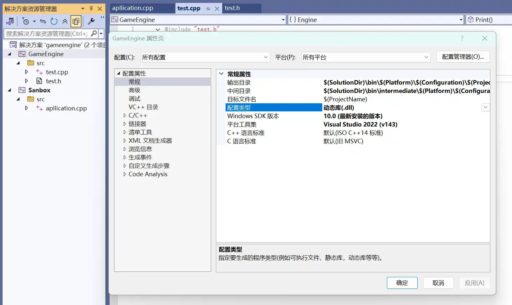
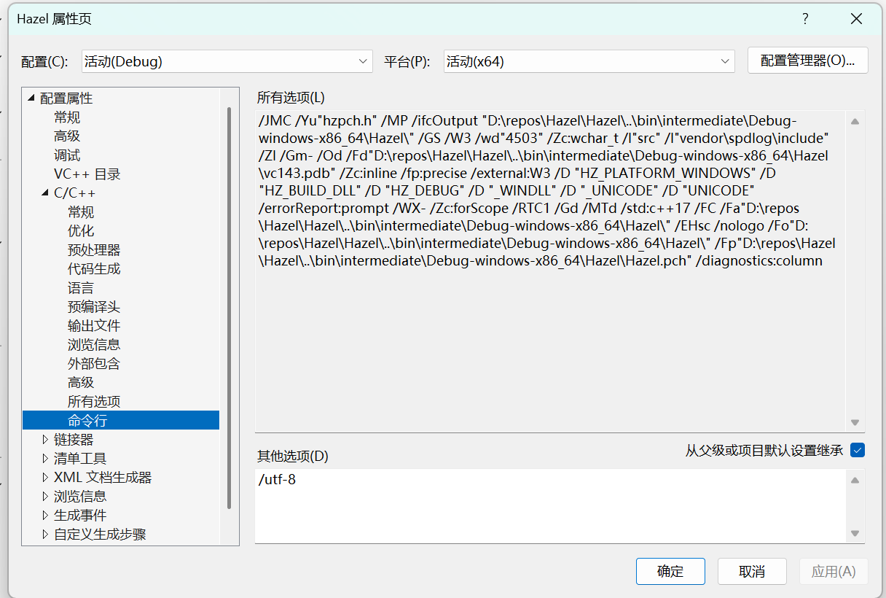

This blog template is built with [Astro](https://astro.build/). For the things that are not mentioned in this guide, you may find the answers in the [Astro Docs](https://docs.astro.build/).


# 一.什么是游戏引擎


创造游戏的工具Unity，Unreal

交互应用，可视化，平台

读取文件(资产，游戏引擎作为输入的文件)、转换他们、然后把他们放到屏幕上，并且也增加了交互能力。

### 一个游戏引擎需要什么？
| Attribute                 | Description                             |
|---------------------------|-----------------------------------------|
| `entry point`             | 入口                                    |
| `application layer`       | 应用层                                  |
| `window layer`            | 系统窗口层(input,event)                 |
| `renderer`                | 渲染器                                  |
| `Render API abstract`     | 渲染API抽象                             |
| `Debugging support`       | Debug支持                               |
| `Scripting languag`       | 脚本语言                                |
| `Memory System`           | 内存系统                                |
| `Entity-Component System` | 实体组件系统                            |
| `Physics`                 | 物理                                    |
| `File I/O`                | 文件I0(VFS)                             |
| `Build System`            | 构建系统                                |


# 二.项目设置


属性设置，将引擎设为动态库，新建一个游戏项目



将引擎链接到游戏


- 说明

  此引用将会链接Hazel.lib文件。

- 问题:
  明明设置为dll为什么会有lib文件。

  解释:
  在动态库情况，有lib和dll两个文件，lib包含被DLL导出的函数的*名称和位置*，DLL包含实际的函数和数据。
  exe程序在编译期间链接lib文件，访问存放了DLL中所要调用的函数的内存地址

打开项目属性-链接器可以看到链接命令



# 三.入口点


我们希望在**游戏中而不是引擎中**决定建立的sandbox，并在**引擎中**实现

```cpp
Hazel::Application* Hazel::CreateApplication()
{
    return new Sandbox();
}
```

```cpp
#ifdef HZ_PLATFORM_WINDOW

extern Hazel::Application* Hazel::CreateApplication();
```

将CreateApplication函数声明为**extern**，表示此函数会在Hazel外部定义，接下来使用的这函数时将使用在外部定义的CreateApplication


- 在Core.h中

  ```cpp
  #pragma once
  #ifdef HZ_PLATFORM_WINDOWS
  	#ifdef HZ_BUILD_DLL
  		#define HAZEL_API __declspec(dllexport)
  	#else
  		#define HAZEL_API __declspec(dllimport)
  	#endif
  #else
  	#error Hazel only supports Windows!
  #endif
  ```

  根据条件编译定义**HAZEL_API**是dll导入还是导出，可知Hazel项目将是__declspec(dllexport)**(导出作为dll的引擎Hazel)**，Sandbox项目是__declspec(dllimport)**(导入引擎dll)**

- 由于Sandbox#include <Hazel.h>，而Hazel项目的Hazel.h**包含**了Application.h，Application.h又包含了Core.h文件，


  ```cpp
  #include <Hazel.h>
  class Sandbox : public Hazel::Application
  {
  public:
  	Sandbox(){}
  	~Sandbox(){}
  };
  ```

  所以Sandbox项目也有**HAZEL_API**宏定义，且**是__declspec(dllimport)**


# Tips

**静态链接**

使用静态库方式链接，编译后链接时会将使用的库函数对应所包含库函数定义的==.o目标文件都包含在exe文件==中。

*优点*

执行速度快：因为可执行文件程序内部包含了所有需要执行的东西

*缺点*

浪费空间：因为多个可执行程序对同所需要的目标文件都有一份副本

更新慢：如果有一个.o目标文件发生改变，那么对应的使用这个.o目标文件的多个可执行程序需要重新来一遍链接过程，即链接多个.o目标文件来实现生成可执行文件。

**动态链接**

使用动态库方式链接，编译后因为推迟链接不会将使用的库函数对应的dll文件都包含在exe文件中，而是==在exe运行的时候将dll加载到内存CPU中再链接==。

*优点*

节省空间：多个可执行程序对同所需要的库函数共享一份副本

更新快：一个源文件发生改变，只需更新编译成dll文件，不用每个可执行程序需要重新来一遍链接过程，因为多个可执行程序在运行时时链接，且共享一份副本

*缺点*

启动速度慢：因为每次执行程序都需要链接

